  

---

## If you're here, you're probably looking for my work

- **[SmartFlow](https://smartflow-sigma.vercel.app/)** — a reinforcement-learning traffic-signal controller that reads live per-lane demand and learns which phase to run. Cuts average vehicle waiting time ~55% vs a fixed-time controller, matches max-pressure heuristics, and extends to a multi-agent 2x2 grid with shared-parameter PPO plus emergency-vehicle preemption.
  `Python` `SUMO` `Stable-Baselines3 (DQN/PPO)` `FastAPI` `React` — [Code](https://github.com/Kcodess2807/SMARTFLOW)

- **[TraceRAG](https://trace-rag.vercel.app/)** — a GraphRAG engine you can *see*. Answers questions over real codebases by fusing vector search with knowledge-graph traversal, then draws the full retrieval path live on a React Flow canvas so every claim traces back to its source. Sub-500ms retrievals, RS256 JWT auth, per-user rate limiting.
  `FastAPI` `LadybugDB` `GLiNER` `React Flow` `Groq` — [Code](https://github.com/Kcodess2807/GraphOps-Studio)

- **Bodhi** — a voice-first AI mock-interview platform. Six-phase adaptive pipeline, four-dimensional scoring, RAG over 10K+ document chunks, and real-time proctoring via FaceNet512, MediaPipe, and YOLOv8. Three-tier storage (memory → Redis → Postgres) with sub-millisecond session latency.
  `LangGraph` `pgvector` `YOLOv8` `FastAPI` `Redis`

---

## A little about me

I'm a B.Tech IT student (GGSIPU, class of 2027) who ships AI systems that run in production — not just notebooks.

In the past year I architected ML pipelines processing 10,000+ aerial images a day at Kanchan Drones, built a real-time exam-proctoring system holding sub-200ms latency on GCP, shipped a policy-aware RAG chatbot that answers in under a second, and taught an 8-week NLP course to 20+ students.

I live at the intersection of computer vision, LLMs, and MLOps. My favorite thing is taking research-grade ideas and turning them into products people can actually use.

**5 national hackathon finals. 2 first-place wins. Still counting.**

---

## GitHub

---

  
  
  
  

